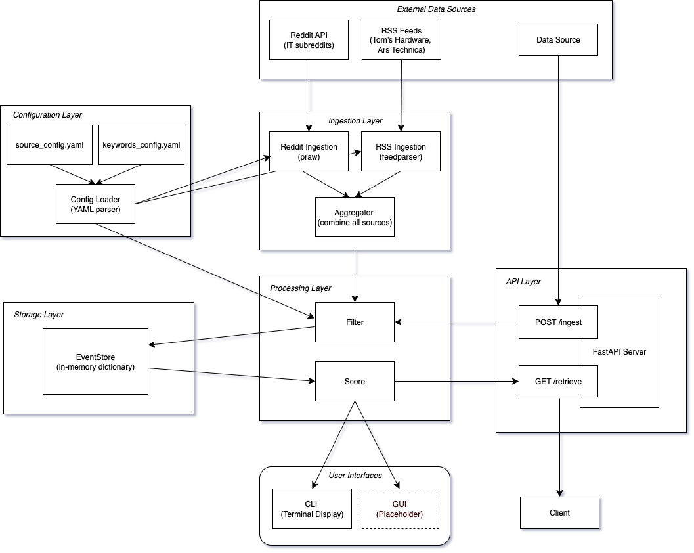

# Solution Design and Implementation

## Executive Summary
This report outlines the design and implementation of a real-time newsfeed system for IT professionals, focused on retrieving relevant, high-priority news such as security incidents or system outages.

The system aggregates data from IT-focused subreddits and RSS feeds using Python libraries (`praw`, `feedparser`), filters content based on predefined keywords, and ranks items by relevance and recency. Relevance is calculated using a scoring system that weights keyword importance and placement (title vs. body), while recency is incorporated through a time-decay function.

An API implemented with FastAPI exposes two endpoints: `/ingest` and `/retrieve`. Ingested news items persist through the session using an in-memory, thread-safe store that supports filtering, deduplication, and ranked retrieval. The solution includes unit testing with `pytest`, continuous integration via GitHub Actions, and centralized logging for observability.

The terminal UI displays the top-ranked news with metadata and scoring details. Though simple, the modular design allows easy upgrades, such as replacing keyword filtering with semantic search, moving to persistent storage, or adding a web interface.

In summary, the system meets all core requirements, is robust and extensible, and provides a solid foundation for future improvements.


## Table of Contents
- [1. Overview of the System](#1-overview-of-the-system)
- [2. Architecture and Design Decisions](#2-architecture-and-design-decisions)
- [3. Data Aggregation and Ingestion](#3-data-aggregation-and-ingestion)
- [4. Content Filtering](#4-content-filtering)
- [5. News Ranking Logic](#5-news-ranking-logic)
- [6. Storage](#6-storage)
- [7. API Implementation](#7-api-implementation)
- [8. Testing and Validation](#8-testing-and-validation)
- [9. Logging and Observability](#9-logging-and-observability)
- [10. Version Control](#10-version-control)
- [11. User Interface](#11-user-interface)
- [12. Future Work / Possible Improvements](#12-future-work--possible-improvements)


## 1. Overview of the System

The goal of this project was to design and implement a real-time newsfeed system that aggregates IT-related news items from selected public sources, filters them for relevance, and provides an easy-to-use interface to display the latest updates. This solution is meant to help IT professionals quickly identify important news such as cybersecurity incidents, software issues, or major disruptions.

## 2. Architecture and Design Decisions

Before diving into the implementation, I carefully reviewed the assignment document outlining the product requirements and started imagining how I wanted my final application to look like to the end user. I had an initial idea in mind, but before proceeding further, I explored existing news reader applications to understand common features and design approaches. Among the free options I reviewed, I found tools like Feedly particularly insightful and well-executed.

Given the limited time of the project, I adopted a minimum viable product (MVP) mindset, focusing on building a basic but functional version of the solution that, despite its simplicity, meets all requirements and has been tested for robustness. As a result, I decided to implement the user interface in the terminal and display the most essential features: a list of event titles ranked by relevance, with the publication date and the first few lines of the body content shown alongside each title.

Stepping back to look at the full picture, I began thinking through the different components needed in the system and how they would interact. As a visual thinker, I sketched a conceptual architecture diagram to illustrate the system's overall structure and the flow between components.


### Architecture Diagram



As shown in the diagram, the main components of the application are as follows (the arrows in the diagram represent the direction of data flow):

- **Ingestion Layer**
  - The **Reddit Ingestion** module uses `praw` to fetch data from the Reddit API.  
  - The **RSS Ingestion** module uses `feedparser` to fetch data from RSS feeds.  
  - The **Aggregator** module combines the results from all sources.  

- **Processing Layer**
  - The **Filter** module receives data from the **Aggregator**, filters it, and stores it in the **EventStore**.  
  - The **Score** module retrieves data from the **EventStore**, scores it, and sends the results to:  
    - the User Interfaces  
    - the `/retrieve` endpoint in the API layer.  

- **Storage Module**
  - The **EventStore** receives filtered items from the **Filter** module, stores them, and returns them to the **Score** module.  

- **API Layer**
  - Contains a **FastAPI server** that exposes two endpoints:  
    - `/ingest`: accepts data from an external data source and sends it to the **Filter** module after removing duplicates.  
    - `/retrieve`: receives scored items from the **Score** module and returns them to the requesting client.  

- **User Interface**
  - **CLI Module**: A basic command-line interface displayed in the terminal.  
  - **GUI Module**: Not yet implemented, but planned as a richer, web-based interface.  

- **Configuration Layer**
  - `source_config.yaml`: Contains details of all data sources.  
  - `keywords_config.yaml`: Contains a list of keywords, organized by priority level.  
  - The Config **Loader** module loads data from the two YAML files and sends:  
    - source configurations to the **Reddit** and **RSS** ingestion modules  
    - keyword configurations to the **Filter** module


### Tech stack
The following libraries and tools are used in this project. Each will be explained in detail in the its respective section.

- `Python` for backend logic and CLI interface 
- `uv` package manager
- `praw` and `feedparser` to pull RSS feeds and Reddit posts
- `FastAPI` for API endpoints
- `Python dict` for in-memory storage
- `Pytest` for testing

## 3. Data Aggregation and Ingestion

This module is responsible for connecting to multiple types of data sources and fetching news events from them. As per the requirements, the system should ingest data from at least one IT-focused Reddit subreddit and one or two IT news websites, such as Tom's Hardware and Ars Technica.

For Reddit ingestion, I discovered that Reddit provides an [API](https://www.reddit.com/dev/api/) to interact with its contents. Additionally, I found a helpful blog post titled _[Scraping Reddit Data Using Python and PRAW: A Beginner's Guide](https://medium.com/@archanakkokate/scraping-reddit-data-using-python-and-praw-a-beginners-guide-7047962f5d29)_, which explained how to interact with Reddit API using the `praw` Python library.

For the IT news websites, I visited the suggested sites and discovered that both offer RSS feeds. This made ingestion much easier and cleaner than scraping and parsing raw HTML. As with Reddit, I looked for a Python library to handle RSS feeds and came across the `feedparser` library, which provided a straightforward and reliable way to parse RSS content.

**Implementation:**

To keep the code organized and easy to maintain, I created an ingestion package containing one Python file per source type (`reddit.py` and `rss.py`). In each file, I implemented a `fetch` function that takes a source configuration as argument and retrieves a list of items (_posts_ for Reddit and _entries_ for RSS), using the respective Python library.

All data sources and their details are listed in a centralized YAML configuration file (`sources_config.yaml`) in the configuration module. This design enables new sources to be added (or existing ones removed) simply by editing this file without requiring any changes to the codebase. As a result, even someone without programming experience can easily update the list of sources.

Each retrieved item is then parsed to extract the fields specified in the requirements: `id`, `source`, `title`, `published_at`*, and optionally `body`. These fields are used to instantiate an `Event` dataclass, conforming to the API contract. Each `fetch` function returns a list of these `Event` instances for further processing.

These events from each source are then combined into a unified list using the `aggregate` function in the `aggregate.py` file.

_*The dates obtained from Reddit and RSS feeds are in POSIX timestamp and time.struct_time formats, respectively, and must be converted to meet the ISO 8601/RFC 3339 UTC timestamp requirements. To handle this, I created two reusable helper functions in the utils module._

## 4. Content Filtering

In order for this application to be useful for IT managers, we need a mechanism to filter out irrelevant content and retain only the most relevant items from the ingested events batch. There are several possible approaches to this problem:

A straightforward approach is keyword-based filtering, which retains items whose text contains predefined keywords related to the topics we're targeting (e.g., "security breach", "system outage", etc.). A more advanced alternative is to use semantic filtering via embeddings. This involves embedding the text of each event into a vector space, embedding the query (e.g., "IT critical security") into another vector, and then computing a similarity score, typically using cosine similarity, to identify the most semantically similar events. The advantage of this approach over simple keyword matching is that it allows for the retrieval of relevant events even if they don't contain the exact query terms but convey a similar meaning.

While the embedding-based approach sounds promising in terms of semantic understanding, I opted for the simpler keyword-based filtering for this version due to time constraints. It's easier to implement and evaluate, and captures most of the relevant items, provided the keywords list is sufficiently broad. The downside of a keyword-approach is it might produce false positives or false negatives.

For example, a false positive might occur if a headline reads _"iOS 17 Update Introduces New Emoji Pack"_. Although it includes the keyword _"update"_, the content is irrelevant to IT operations.

A false negative could occur with a headline like _"Zero-day exploited in the wild compromises critical infrastructure"_. Even though this is highly relevant, it may be missed if the keywords list includes only _"exploit"_ but not _"exploited"_, because keyword matching does not account for different grammatical forms of the same word.

The semantic filtering approach using embeddings would handle false positives and false negatives much more effectively and should replace the keyword-based filtering in future versions of the application.


**Implementation:**

To implement keyword-based filtering, the first step was to define a set of relevant IT-related keywords. To do this, I used a combination of different LLMs (`GPT-4o`, `Claude-4-Sonnet`) to generate an initial list, which I then reviewed and expanded manually. To ensure case-insensitive matching, both the keywords and text from the news items were converted to lowercase. For efficient lookups, I stored the keywords in a Python `set`, enabling constant-time _O(1)_ membership tests.

The next step was to count keyword occurrences in each textual field of the news items, namely the `title` and `body` fields. For this, I used Python's built-in `Counter` class from the `collections` module. `Counter` is a subclass of `dict` that counts the number of times each item appears in a list. Before being able to use it though, the text needs to be split into a list of word tokens.

I evaluated three methods for tokenizing the text, each with pros and cons:

- **str.split():** \
  The built-in `str.split()` function splits a string using a specified delimiter (in our case, a space). It's fast and doesn't require any external libraries. However, it treats punctuation as part of the word, so tokens like _"update,"_ or _"vulnerability."_ may not match keywords such as _"update"_ or _"vulnerability"_.

-	**spaCy tokenizer**: \
This method uses a pre-trained language [processing pipeline from spaCy](https://spacy.io/usage/processing-pipelines) to tokenize text. The advantage of this approach is that it accurately separates words from punctuation, however, it is much slower, as these NLP pipelines perform additional tasks (e.g., part-of-speech tagging, named entity recognition) that aren’t necessary for our use case. *(In the future, it might be worth trying use only the [tokenizer](https://spacy.io/api/tokenizer) from the spaCy package).*

- **Regex-based tokenization:**  
  This method uses a regular expression to extract word tokens from text. To match word tokens, I used the regular expression `r"\b\w+\b"`. This pattern captures alphanumeric sequences bounded by word boundaries. It's nearly as fast as `str.split()` and produces a significantly higher number of correctly matched tokens, since it ignores surrounding punctuation. I selected this method for the final implementation.


## 5. News Ranking Logic

The assignment requires that filtered news items be ranked by both relevance and recency, in a deterministic way, meaning the ranking should be stable for a given input. To get a working system quickly, I initially ranked the news solely by recency, using a simple approach: sorting items by their publication timestamp in descending order (most recent first). This basic implementation was straightforward and consisted of a single line of code.

In the next iteration, I implemented a more intelligent ranking mechanism that accounts for both importance and recency. There are many ways to model this, but I chose to compute a **Total Score** for each event by multiplying two components: _**Importance Score × Recency Score**_

### Importance Score

The importance of an event is determined by keyword matches on two dimensions:

1. **Keyword Priority**  
   Keywords are divided into three levels of priority:
   - High priority keywords are worth 3 points
   - Medium priority keywords are worth 2 points
   - Low priority keywords are worth 1 point

2. **Keyword Location**  
   Matches in the title are weighted more heavily than those in the body, since titles often summarize the most critical part of the news.
   - Each keyword match in the title is multiplied by 2
   - Matches in the body retain their original score

This helps prioritize the most relevant information, typically found in title headlines, over less important supporting details in the body.

### Recency Score

News becomes stale quickly, especially in IT and cybersecurity, where a delay of even a few hours in discovering a vulnerability can be critical. To reflect this, I designed a non-linear time decay function that reduces the recency score as time passes, with a curve that flattens over time. This means that very recent items are ranked much higher, while older items lose importance more gradually as they age. For example, the score difference between news items published now and 2 hours ago is significant, while the score difference between news items published 20 and 22 hours ago gets much lower.

I experimented with different decay functions by visually analyzing their curve and ultimately selected the following:

**1 / (`coef` × `hours_since_publication` + 1), where `coef` = 0.1**

The coefficient (`coef`) can be modified to control the steepness of the decay, that is a smaller coefficient increases the weight of older news, while a larger coefficient favors more recent news more aggressively.

## 6. Storage

In the context of this MVP implementation, I chose an in-memory storage solution using a Python dictionary to store filtered events. While this approach has limitations in terms of persistence and scalability, it provides great performance for the current requirements and simplifies the overall system architecture.

**Implementation:**

The storage system is implemented as an `EventStore` class in `store.py`. By instantiating it as a singleton, it acts as a centralized data store shared across the system, including the ingestion API, the retrieval logic, and the user interface.

The core storage mechanism uses a Python dictionary (`filtered_events_with_counts_dict`) where each event's unique `id` serves as the primary key, allowing for fast lookup and duplicate detection. 

The stored value is a dictionary containing three components:
- `event`: The original `Event` object with all its fields
- `kw_counts_in_title`: A count of keyword matches found in the event's title
- `kw_counts_in_body`: A count of keyword matches found in the event's body

This structure allows the system to preserve both the original event data and the filtering metadata needed for scoring and ranking.

**Thread Safety:**

Since the system may handle concurrent requests (especially in a web API context), I implemented thread safety using Python's `threading.Lock()`, using inspiration from this blog post, [threading.Lock for Primitive Locking](https://realpython.com/python-thread-lock/#threadinglock-for-primitive-locking), by Adarsh Divakaran. All read and write operations to the store are protected by a lock, ensuring data consistency when multiple threads access the storage simultaneously.

**Key Methods:**

- `add_events()`: Accepts a list of filtered events with their keyword counts (as described above), and stores them in the in-memory dict structure, with the respective `ids` as keys. The method checks for existing `ids` in the keys of the store structure before inserting any new events. If a duplicate is detected, it logs a warning message and skips the duplicate, ensuring data integrity without failing the entire ingestion process.
- `get_sorted_events()`: Retrieves all stored events, applies scoring logic, and returns them sorted by relevance and recency. 
- `has_event()` and `get_event_count()`: Utility methods for checking event existence and retrieving store statistics
- `clear()`: Removes all stored events, primarily used for testing and system resets

***Important Note**: As described above, event scoring is not computed during ingestion but rather during retrieval, using the current time to calculate the recency component of the score. This ensures that the time since publication is measured from the moment of retrieval, keeping the ranking accurate and dynamic, even when events were ingested at different times.*

**Trade-offs:**

While in-memory storage provides fast access times and simplicity, it has several limitations: 
- **No persistence**: All data is lost when the application restarts
- **Memory constraints**: Large datasets could exhaust available memory

For a production system, the in-memory storage could be replaced with either persistent file storage or a database solution (e.g., PostgreSQL, MongoDB) without requiring changes to the rest of the application. Only the implementation of the EventStore class would need to be modified.

## 7. API Implementation
I chose to use the FastAPI library for its simplicity, high performance, and automatic generation of OpenAPI documentation via Swagger, which provides a clean, interactive interface for exploring and testing the API. I also found the [documentation](https://fastapi.tiangolo.com/tutorial/first-steps/) to be very clear.

I implemented two endpoints, `/ingest` and `/retrieve`, as specified in the API contract. The logic for each is described below.

### `/ingest` Endpoint

The `/ingest` endpoint is implemented as a `POST` request, as it is designed to accept a `JSON` array (or stream) of event objects.

For valid ingestion requests, the API contract states that *"The call returns an acknowledgment (HTTP 200 / successful exit status / ACK message)."* Since the contract does not specify a strict response schema, I chose to return the following `JSON` object:

```json
{
  "message": "ACK",
  "status": "successful exit"
}
```

To validate the structure and types of incoming event objects, I used an `Event` dataclass with type annotations. `FastAPI` automatically performs data validation using `Pydantic` models behind the scenes. If the submitted data does not match the expected schema or types, `FastAPI` will return an appropriate `422 Unprocessable Entity` error.

#### Handling Duplicate Event IDs
There are two possible sources of duplicate event IDs during ingestion:

1. The event may already exist in the in-memory storage system.
2. The event may appear more than once within the same ingestion batch.

I handled both cases explicitly in my implementation of the `/ingest` API endpoint. Also, the API contract specifies that each event must have a unique `id` field, but it does not clarify what to do when duplicates are encountered. In my implementation, I chose to **skip duplicates** and log a **warning message** indicating that the event was ignored due to a duplicate ID.

This ensures that no duplicate events are processed or stored, the system behaves deterministically, and that the `/retrieve` endpoint returns a clean, de-duplicated, and stable set of filtered news events, as per the requirements.

Rather than failing fast or rejecting the whole batch, I opted for a more practical approach: accept valid events and skip any duplicates. This makes the system more robust, especially in real-time scenarios where duplicate events can occur due to retries or overlapping sources.

Now that the events are type checked and de-duplicated, we can filter them by passing them to the `keyword_based_filter` function (*see Content Filtering section for details*). The resulting `filtered_events`, along with their keyword match counts, are then added to the `store`, as we will see in the *Storage* section.

### `/retrieve` Endpoint

The `/retrieve` endpoint is implemented as a `GET` request, since it does not accept input data and only returns the ranked, filtered events.

As the contract specifies that this must be a synchronous call, I deliberately omitted the `async` keyword in the function definition (unlike the `/ingest` endpoint).

In this call, the sorted events are retrieved from the in-memory store using the `get_sorted_events()` method. This method dynamically computes each event's total score based on its importance and recency at the time of retrieval. Once the list is sorted, we extract the original event objects from the scored results and return them to the caller.

## 8. Testing and Validation

To ensure the reliability and correctness of my application, I implemented tests throughout the development process. This helped me verify that individual components behaved as expected and allowed me to catch bugs early, saving time in the long run. I structured the tests in a dedicated module for clarity and separation of concerns. The module includes three test categories:

- Unit Tests
- Integration Tests
- End-to-End (E2E) Tests

Since I used Git for version control and hosted the project on GitHub, I also configured Continuous Integration (CI) with GitHub Actions. This setup ensures that all tests run automatically on each push, helping maintain code quality over time.

I used `pytest` as the main testing framework, as it integrates well with `FastAPI` and asynchronous Python code. I found this [Pytest Tutorial](https://www.youtube.com/watch?v=EgpLj86ZHFQ) by Tech With Tim, which includes how to use mocks, to be a helpful resource.

### Unit Tests

I structured unit tests into separate files by module for better maintainability:

For clarity and ease of use, I separated the tests into one test file per module: `test_ingestion.py`, `test_processing.py`, `test_api.py`, `test_utils.py`.

### Ingestion Tests

The ingestion process involves fetching data from external sources (e.g., RSS feeds, Reddit). Directly calling these live APIs during tests is not ideal because:
- The data changes frequently, leading to inconsistent results
- External APIs may have rate limits or availability issues

To address this, I mocked the external calls using `pytest-mock`. This allowed me to isolate and test my own ingestion logic using predefined, static input data.

### Processing Tests

These tests verify the filtering and ranking behavior of the system and ensure the outputs are deterministic, as required in the project specification.

Since I implemented keyword-based filtering, the logic is predictable and testable. To validate this, I created sample events that either contained or omitted target keywords and confirmed that the filter returned only relevant items containing the expected keywords.

For ranking, I designed deterministic logic based on keyword priority, whether the keyword appears in the title vs. body, and recency (See News Ranking Logic section for details). I tested ranking correctness by crafting sample events with known differences in keyword priority, their belonging to the title or body, and timestamps. This ensured the sorted output matched the expected order.

### API Tests

To test the `/ingest` and `/retrieve` `FastAPI` endpoints, I used `FastAPI`'s built-in `TestClient`. This client enables in-process API testing, which allowed me to simulate requests and responses without running a live server. The [FastAPI Testing tutorial](https://fastapi.tiangolo.com/tutorial/testing/) provides helpful guidance for getting started.

I simulated both ingestion and retrieval scenarios using this client and verified that the filtering and ranking logic executed as expected, and that the endpoints fully complied with the specified API contract.

### Ingest Endpoint Tests

For valid ingestion requests, I confirmed that the API accepted a `JSON` array of events with the required fields, returned a response with a `HTTP 200` status, and included a simple acknowledgment message in the response, as required by the API contract.

To validate robustness and error handling, I tested several edge cases:
- Malformed events (e.g., wrong field types or missing required fields): I verified that the endpoint correctly returned a `422 Unprocessable Entity` status.
- Duplicate event IDs: I tested ingestion requests containing events with duplicate `id` values, ensuring that the duplicated items were skipped.

### Retrieve Endpoint Tests

I verified that the `/retrieve` endpoint returned only the events accepted by the filter, used the same `JSON` shape as the ingestion input, and sorted the results according to relevance × recency, as required by the API contract.

## 9. Logging and Observability

To monitor system health and performance, I implemented logging throughout the application, following the [Python documentation](https://docs.python.org/3/howto/logging.html). I created a `logging_config.py` file in the `utils` folder, which defines the logging configuration for the entire application. This includes where the logs are written (e.g. file or console), the log levels (`DEBUG`, `INFO`, `WARNING`, `ERROR`, etc.), and the format, such as timestamp formatting and log message structure. 

I chose to write logs to the Console standard output, as well as to file at path logs/newsfeed.log for further analysis. I typically switch between DEBUG and INFO levels depending on the current needs. The logging settings can easily be adjusted in the config file and will propagate throughout the application.

*Note: To enable log output during tests, `pytest` requires some additional setup in the `pyproject.toml` file, as it captures log messages of level WARNING or above by default [[pytest docs - How to manage logging](https://docs.pytest.org/en/stable/how-to/logging.html)].*

## 10. Version Control

Since I developed this application iteratively under time constraints, I used Git to maintain a clear and traceable development history. I began by committing the project structure and an initial MVP version that satisfied the core requirements of the assessment. This gave me a stable foundation to build upon, allowing me to continue testing, refactoring, and adding features with confidence, as I could always roll back to a working version if newer changes introduced bugs that broke the requirements.

As mentioned in the *Testing and Validation* section, I also configured Continuous Integration (CI) with [GitHub Actions](https://docs.github.com/en/actions/get-started/quickstart), allowing the tests to run automatically on each push and helping maintain code quality over time.

## 11. User Interface

Due to time constraints, and since the web interface was optional in the requirements, I opted for an initial terminal-based user interface, which allowed me to focus on the backend while satisfying the minimum requirements. The web UI could be a nice further improvement.

After a welcome message, the UI displays the list of news sources included in the `sources_config` `YAML` file, and displays how many items were retrieved for each source. For performance evaluation, it also displays the time it took to fetch and aggregate all events.

To keep the user informed of the progress, it then displays that it is "Filtering events", and shows the number of retained news events.

It then displays top 10 events, ranked by score (importance × recency), with the following fields:
- Title
- Source (e.g., Tom's Hardware)
- Published date
- First 200 characters of the body
- Score (including the details of the importance and recency scores)
- Keywords found in title with counts
- Keywords found in body with counts

The feed gets refreshed every 60 seconds, with the app showing a countdown at the bottom. Users can quit the application using `Ctrl+c`.

## 12. Future Work / Possible Improvements

The current version of the system meets the core requirements and performs well for filtering, ranking, and displaying IT-related news in real time. That said, there are several areas where the system could be extended or improved with more time or resources.

### Filtering and Ranking
The current keyword-based filtering approach works well for a simple MVP, but more robust results could be achieved using **semantic filtering through embeddings**. This would allow the system to capture events that are semantically related to a given topic or user query (e.g., _"IT critical security"_) even if the exact keywords don't appear in the text. Each news item's text could be embedded into a vector space (e.g., using a pretrained embedding model such as [Sentence-BERT](https://sbert.net/)), and similarity with a predefined or user-provided query could be computed using cosine similarity. This approach would have two advantages: 
 - 1. It would reduce false negatives and improve the relevance of retrieved content. 
 - 2. The cosine similarity value could be directly incorporated in the calculation of the score for ranking. 

If keyword filtering were to be retained, ranking could be improved using techniques like **stemming** or **lemmatization** (e.g., with spaCy or NLTK), which normalize words to their base or root form. This would help avoid missed matches due to differences in verb conjugation (e.g., "exploited" vs. "exploit") or singular vs. plural forms (e.g., "compromises" vs. "compromise"). However, this alone would not resolve the broader issue of false positives and false negatives.

### Storage
For production use, the in-memory `EventStore` could be replaced with a persistent backend, such as file-based storage or a database (e.g., PostgreSQL or MongoDB). This could be easily incorporated without modifying the rest of the application, since all data access goes through the `EventStore` abstraction.

### UI and UX
The CLI interface could be expanded into a simple web dashboard, providing a nicer and more convenient interface, especially for non-technical users who may not be comfortable with the terminal. A lightweight Flask-based web app could serve as the foundation, using HTML templates and basic styling (e.g., Bootstrap) to display the ranked newsfeed. Additional features like continuous fetching and topic-based filtering could be layered in gradually. For added interactivity, users could be allowed to add new sources directly from the UI, making the system more flexible and dynamic.

### Testing
For a larger application, the test suite could be expanded to include integration tests and basic end-to-end (E2E) coverage to verify system behavior across components such as the API, storage, and filtering logic. These tests would help ensure correctness as the application grows in complexity, making the system more maintainable and production-ready.